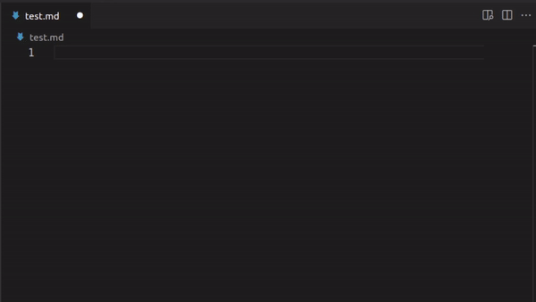
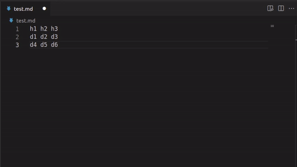
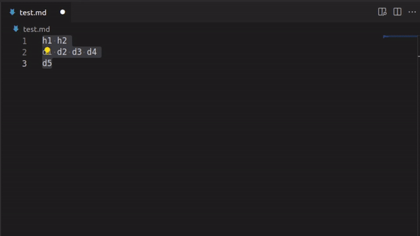

# Markdown Cells

The purpose of this extension is to help you write cleaner markdown.

Using table in markdown can be painfull because of all the syntax you need to put aroud the data you want to present. Markdown Cells simplify those table by introducing time saving functionalities.

## Features

### Generate Table

> To execute: Press SHFIT + P and select `Markdown cells: Generate table`

There is two way of generating a table.

Firstly, you can generate a fully empty table by executing the command and specifying a dimension using the `width x height` format. The table will appears at the current position of your cursor.

</img>

You can also create table prefilled with already existing data. You just need to select the data you want to transform and execute the command.

</img>

If the number of data in each line isn't consistent, the maximum width will be used and all missing data will be auto-filled

</img>

> Warning: The data that is used as input will be replace by the table !

## Requirements

There is no requirement nor dependencies for this extension.

## Extension Settings

There is no way to configure this extension for the moment.

> Coming soon !

## Known Issues

No issues have been spotted yet. Don't hesitate to create a ticket if you've experienced one.

## Roadmap

### Features to come

- Add/remove columns and lines.
- Configuration of the delimiters used to generate table using existing data.
- Hide commands when user isn't in markdown file.
- Format table. 

## Release Notes

### 1.0.0

Initial release of the extension.

First iteration of the `Generate table` command.